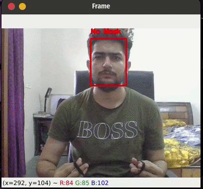

### Facemask Detection

Real time face mask detection with a CNN. It's a reproduction of Goyal et al. (2022), with both the web app and the training code in one place. Built for a computer vision course.

Was live at `mask.nashiru.me` during the semester.



#### What's here

- `web/`: SvelteKit frontend plus a FastAPI backend that serves the inference API, with a Docker setup for deploy. The trained model is bundled so it works out of the box.
- `training/`: the model side. Notebooks and scripts to train and evaluate a custom CNN and a MobileNetV2 version, plus the experiment writeups.

#### How it works

Two stages. A res10 SSD face detector (OpenCV DNN) finds the faces, then the CNN classifies each one as mask or no mask. Same pipeline for still images and video.

#### Run the web app

```bash
cd web/deploy
docker compose up --build
```

Backend serves the inference API, frontend talks to it. The compose file and nginx config are in `web/deploy`.

#### Training

Everything is in `training/`. `dataset_sample/` has a few images so you can see the format. The full ~4000 image dataset comes from the original repo (linked below).

```bash
cd training
pip install -r requirements.txt
# open Model_Training.ipynb, or run the script version:
python train_eval.py
```

#### Credits

Training code is adapted from [techyhoney/Facemask_Detection](https://github.com/techyhoney/Facemask_Detection), modified so it trains end to end, and that's also where the full dataset lives. Paper: Goyal et al., "A real time face mask detection system using convolutional neural network" (2022), DOI `10.1007/s11042-022-12166-x`.

#### License

[MIT](LICENSE). The adapted training code keeps the original repo's MIT license too (`training/LICENSE`).
